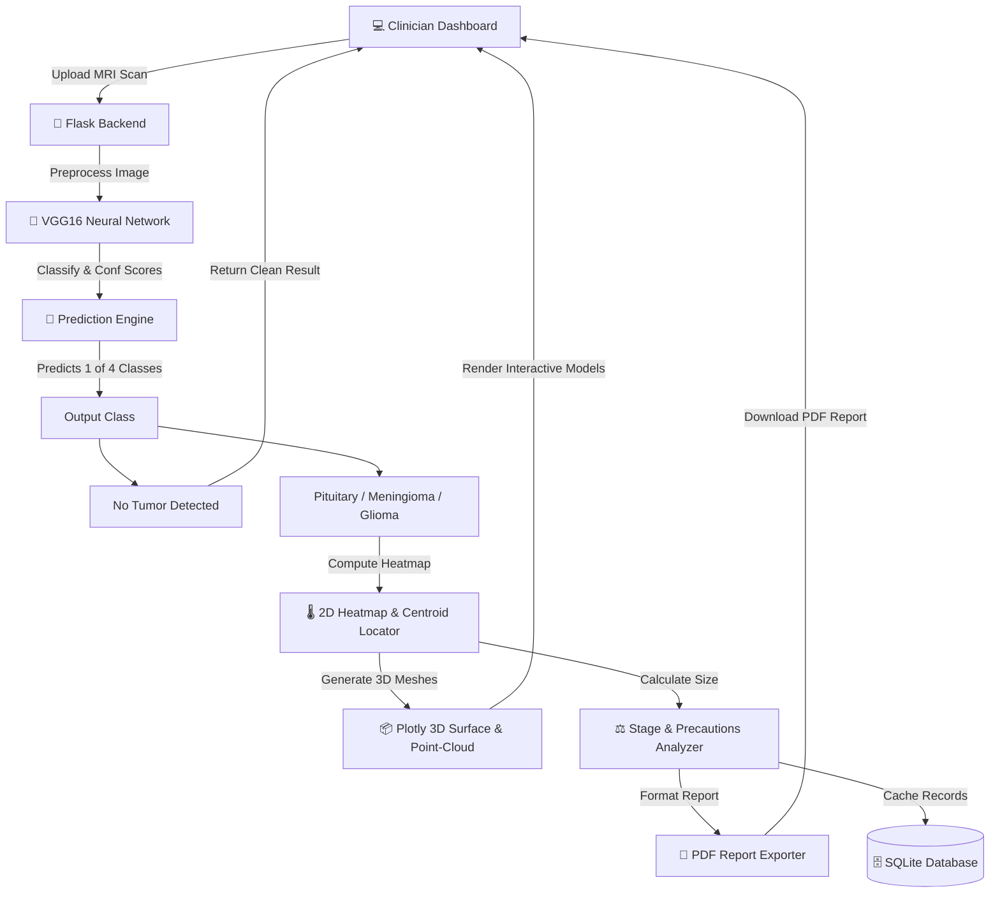

# 🧠 NeuroScan AI — Brain Tumor Detection System

<p align="center">
  
  
  
  
  
</p>

---

## 🌟 Introduction
**NeuroScan AI** is an advanced, AI-powered diagnostic support application designed to assist medical professionals in detecting and analyzing brain tumors from MRI scans. Using **VGG16 transfer learning**, the system performs multi-class classification and provides dual-dimensional (2-D/3-D) structural visualizations to highlight the exact tumor boundaries, generating localized stage descriptions, medical precautions, and printable PDF reports.

---

(🚀 Live Demo)[https://brain-tumor-detections.vercel.app/]
## ⚙️ Core Architecture & Pipeline

Below is the workflow showing how an MRI scan is processed from user upload through prediction, visualization generation, and secure storage in the SQLite history.



---

## ✨ Features

| Feature Category | Capabilities & Details |
| :--- | :--- |
| **🔍 4-Class Classification** | Detects and classifies scans into **No Tumor**, **Pituitary Tumor**, **Meningioma Tumor**, or **Glioma Tumor**. |
| **🎯 Confidence & Metrics** | High-precision per-class probability mapping displayed as progress indicators. |
| **🌡️ Grad-CAM Visualizations** | Extracts feature maps to generate a color-coded 2D overlay indicating high-intensity tumor regions. |
| **📦 3D Brain Modeling** | Renders interactive Plotly 3D surface charts and 3D point cloud models estimating tumor depth in brain coordinates. |
| **📋 Stage & Medication Engine** | Dynamically evaluates tumor area percentage to classify stages (Early / Intermediate / Advanced) and fetches drug/treatment guidelines. |
| **📄 PDF Reports** | Auto-generates downloadable patient reports containing diagnosis details, clinical parameters, and visual overlays. |
| **🔐 Secure Authentication** | Implements standard session logins, salted bcrypt password hashing, security question resets, and OTP confirmations. |
| **🌗 Custom Glassmorphism Theme** | Clean dark/light theme options persisted via `localStorage` for visual comfort during diagnostic readings. |

---

## 🏗️ Technical Stack

- **Backend**: Python 3.11, Flask 3.0, Flask-Bcrypt, Flask-Mail
- **Machine Learning**: TensorFlow 2.15, Keras, NumPy, OpenCV, Pillow, scikit-learn
- **Frontend / Graphics**: Plotly (3D visualizations), HTML5 (Jinja templates), TailwindCSS/Vanilla CSS, Font Awesome, Google Fonts
- **Database**: SQLite3 with auto-migrations and indexing

---

## 📁 Project Structure

```
brain-tumor-detection/
├── app.py                  # Main Flask application (Routes, API, Analytics)
├── train_model.py          # Model training pipeline (Fine-tunes VGG16)
├── gradcam.py              # Visual explanation & Grad-CAM algorithms
├── run.py                  # Server configuration runner
├── check_packages.py       # Dependency configuration verifier
├── requirements.txt        # Python dependency manifest
├── model_integration.md    # API and model loading manual
├── models/                 # Neural network storage (ignored by git)
│   └── brain_tumor_cnn_model.h5
├── templates/              # Flask HTML pages (Jinja2 templates)
│   ├── home.html           # Diagnostic workspace dashboard
│   ├── login.html          # Authentication portal
│   ├── register.html       # Account registration
│   ├── about.html          # Application technical details
│   ├── history.html        # Historical records management
│   ├── profile.html        # Account details & aggregate stats
│   ├── forgot_password.html# OTP/Email reset wizard
│   ├── reset_password.html # New password entry page
│   └── security_reset.html # Security question verification
├── uploads/                # Temporary file buffer (ignored)
├── users.db                # SQLite database repository (ignored)
└── tests/                  # Pytest automated testing suite
    ├── __init__.py
    └── test_app.py         # App logic & API route assertions
```

---

## ⚡ Quick Start

### 1. Clone the Repository
```bash
git clone https://github.com/deepthi-tr05/brain-tumor-detection.git
cd brain-tumor-detection
```

### 2. Set Up Virtual Environment
```bash
python -m venv venv

# Windows
venv\Scripts\activate

# macOS/Linux
source venv/bin/activate
```

### 3. Install Dependencies
```bash
pip install -r requirements.txt
```

### 4. Fetch/Train the Model
Make sure a trained `.h5` model exists in the `models/` directory.

- **Option A (Train Custom Model)**: Add your classified MRI datasets inside `data/` (`Training/` and `Testing/` folders) and run:
  ```bash
  python train_model.py
  ```
- **Option B (Download Release)**: Download a pre-trained model directly from the [Releases](https://github.com/deepthi-tr05/brain-tumor-detection/releases) page and drop it in the `models/` folder.

### 5. Launch the Application
```bash
python app.py
```
Visit the server locally: **[https://brain-tumor-detections.vercel.app/](http://127.0.0.1:5000)**

---

## 🧪 Automated Testing

Verify system reliability by running the complete suite of **48 tests** (checking endpoints, authentication, database migrations, preprocessing, and prediction calculations):

```bash
pip install pytest
python -m pytest tests/ -v
```

---

## 🔌 API Reference

| Method | Endpoint | Auth Required | Action |
| :--- | :--- | :--- | :--- |
| **GET** | `/` | Yes | Renders Workspace Dashboard |
| **POST** | `/predict` | Yes | Submits MRI image for AI classification & 3D visualization |
| **POST** | `/api/save-scan` | Yes | Commits prediction metrics, patient details, and metadata to history |
| **GET** | `/api/history` | Yes | Retrieves full historical scans linked to the active doctor session |
| **GET** | `/api/scan-detail/<id>` | Yes | Retrieves detailed diagnosis metrics and prescriptions for a single scan |
| **POST** | `/api/send-otp` | No | Sends password recovery code to registered email addresses |
| **POST** | `/api/verify-otp` | No | Validates recovery OTP and returns a session token |
| **GET** | `/api/profile-stats` | Yes | Calculates clinic dashboard metrics (total tumor count, recovery percentage) |

---

## ⚠️ Medical Disclaimer
*NeuroScan AI is a diagnostic support tool created for research and educational purposes. This application does not replace clinical evaluations, radiological reports, or direct consultation with qualified neurologists/radiologists. Do not make surgical or therapeutic treatment decisions based solely on these visualizations.*

---

<p align="center">Built with ❤️ using TensorFlow, Flask, and Plotly</p>
